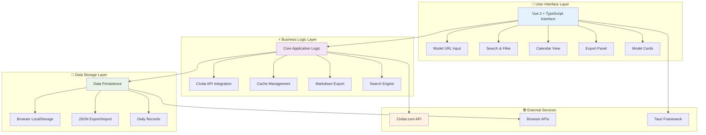
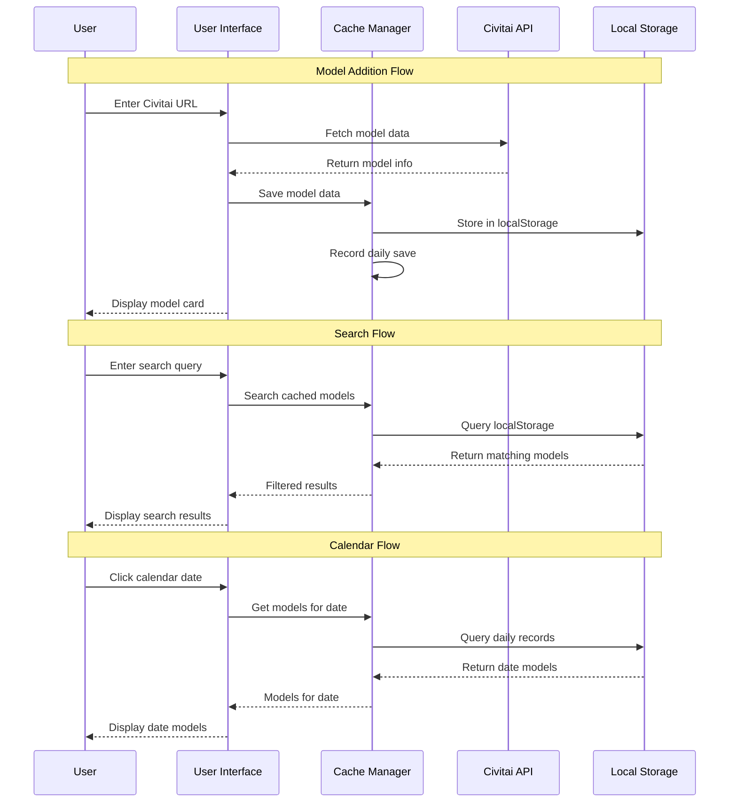
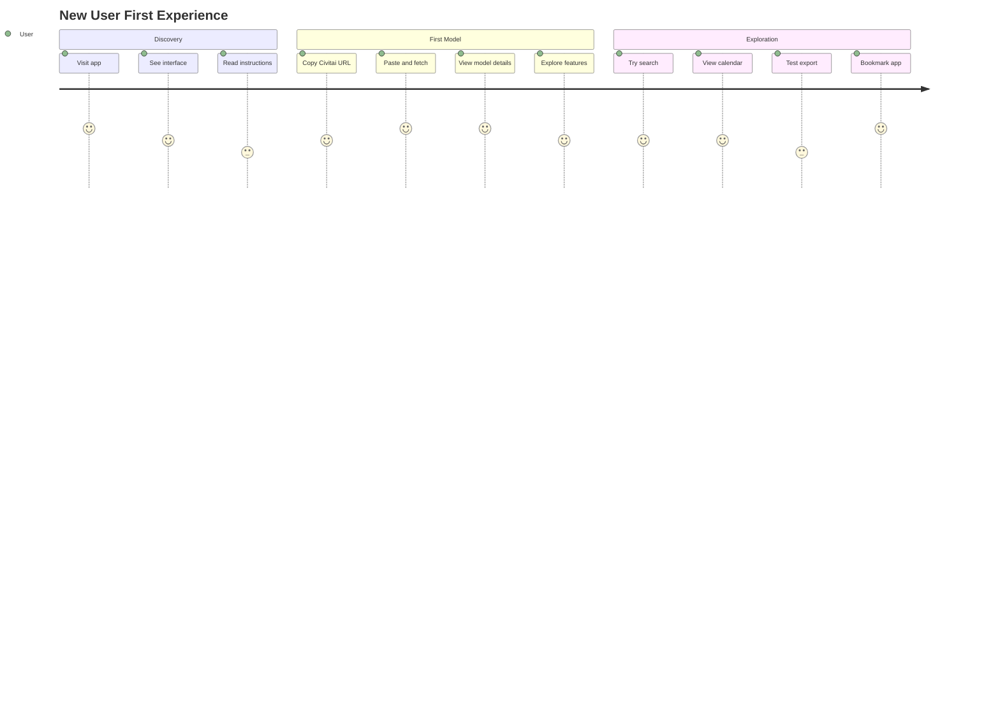
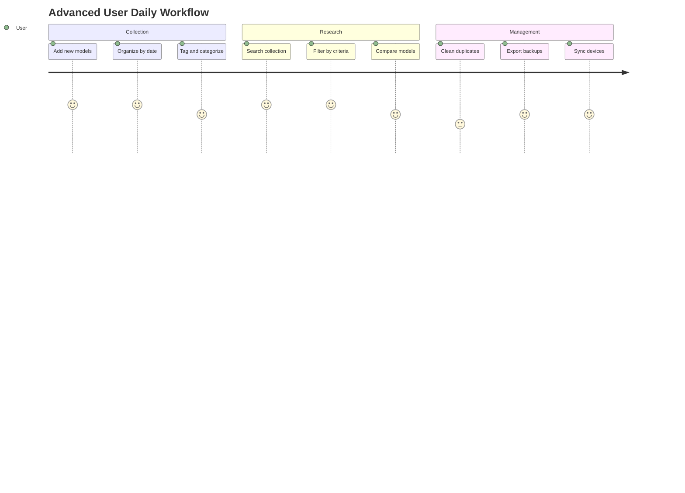
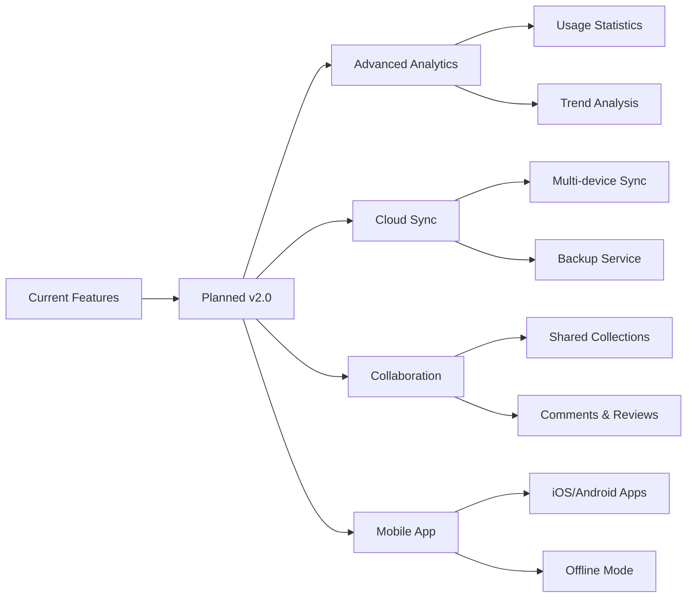

# Software Architecture & Features Overview

## 🏗️ Application Architecture

## 🔄 Data Flow Diagram

## 📋 Feature Matrix

| Feature | Description | Status | Access Method |
|---------|-------------|--------|---------------|
| 🔍 **Model Fetching** | Get model info from Civitai URLs | ✅ Active | Main input field |
| 🔎 **Smart Search** | Search across all model data | ✅ Active | Search box + advanced filters |
| 📅 **Calendar View** | GitHub-style activity calendar | ✅ Active | Calendar button |
| 📊 **Data Grid** | Overview of all data dates | ✅ Active | Data grid button |
| 💾 **Cache System** | Automatic local data storage | ✅ Active | Background + manual controls |
| 📤 **Export Options** | Multiple export formats | ✅ Active | Cache management panel |
| 📥 **Import System** | JSON data import | ✅ Active | Import button |
| 🌐 **Multi-language** | English/Chinese interface | ✅ Active | Language switcher |
| 🌓 **Theme Support** | Light/dark mode | ✅ Active | Auto-detection |
| 🖼️ **Image Gallery** | Model image carousel | ✅ Active | Model cards |
| 🏷️ **Metadata Display** | Training words, prompts, etc. | ✅ Active | Model cards |
| ⚙️ **Settings Panel** | Configuration options | ✅ Active | Various UI elements |

## 🎯 User Journey Maps

### New User Journey

### Power User Journey

## 🔧 Technical Components

### Frontend Stack
- **Framework**: Vue 3 with Composition API
- **Language**: TypeScript for type safety
- **Styling**: TailwindCSS for responsive design
- **Icons**: Emoji + SVG icons
- **State**: Reactive refs and computed properties

### Data Management
- **Storage**: Browser localStorage
- **Caching**: Automatic model data caching
- **Export**: JSON, Markdown, ZIP formats
- **Search**: Client-side full-text search
- **Calendar**: Date-based data organization

### External Integration
- **API**: Civitai REST API
- **CORS**: Handled via browser/Tauri
- **Images**: Direct Civitai CDN links
- **Downloads**: Browser download API

## 🎨 UI/UX Patterns

### Design Principles
- **Responsive**: Mobile-first, desktop-optimized
- **Accessible**: Keyboard navigation, screen readers
- **Intuitive**: Clear visual hierarchy
- **Consistent**: Unified color scheme and typography

### Interaction Patterns
- **Progressive Disclosure**: Advanced features hidden by default
- **Contextual Actions**: Right-click menus for relevant options
- **Visual Feedback**: Loading states, success/error messages
- **Shortcuts**: Keyboard shortcuts and quick actions

## 🔮 Future Enhancements

---

*Architecture documentation for developers and advanced users*
