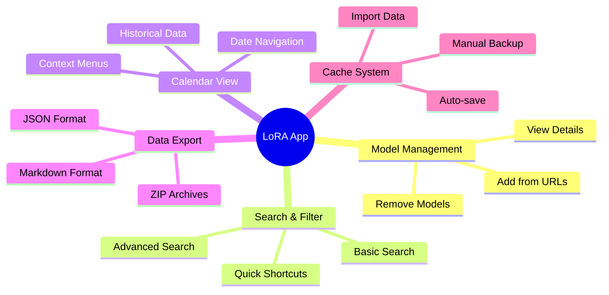
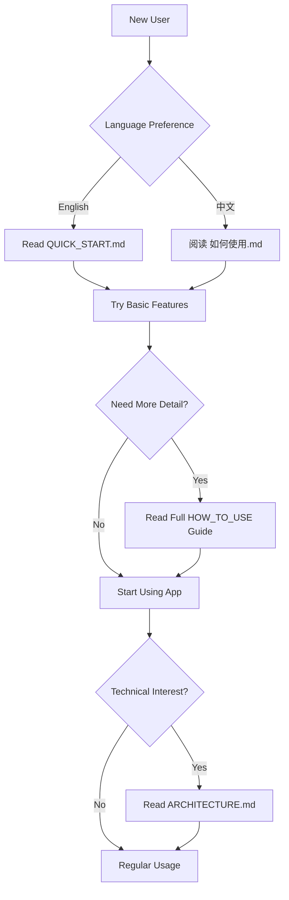

# 📚 Documentation Overview - LoRA Model Info Downloader

This repository contains comprehensive documentation for using the LoRA Model Information Downloader application.

## 📖 Available Documentation

### 🚀 User Guides

| Document | Language | Purpose | Target Audience |
|----------|----------|---------|-----------------|
| [`HOW_TO_USE.md`](./HOW_TO_USE.md) | English | Complete usage guide | All users |
| [`如何使用.md`](./如何使用.md) | 中文 | 完整使用指南 | 中文用户 |
| [`QUICK_START.md`](../QUICK_START.md) | English | Quick reference | New users |

### 🏗️ Technical Documentation

| Document | Purpose | Target Audience |
|----------|---------|-----------------|
| [`ARCHITECTURE.md`](./ARCHITECTURE.md) | System architecture & design | Developers, advanced users |
| [`README.md`](./README.md) | Project overview | All users |
| [`README_EN.md`](./README_EN.md) | Project overview (English) | English users |

## 🎯 Which Guide Should You Use?

### 👶 **New Users**
Start with [`QUICK_START.md`](../QUICK_START.md) for a 5-minute overview, then refer to the full guides as needed.

### 📚 **Regular Users**
Use [`HOW_TO_USE.md`](./HOW_TO_USE.md) (English) or [`如何使用.md`](./如何使用.md) (Chinese) for comprehensive feature explanations.

### 🔧 **Developers & Power Users**
Check [`ARCHITECTURE.md`](./ARCHITECTURE.md) for technical details and system design.

## 🌟 Key Features Covered

All guides cover these essential features:

## 🔄 Documentation Workflow

## 📝 Documentation Features

### 🎨 **Visual Learning**
- Mermaid diagrams for workflows
- Step-by-step screenshots
- Interactive flowcharts

### 🔍 **Easy Navigation**
- Clear table of contents
- Cross-references between guides
- Searchable content

### 🌐 **Multi-language Support**
- English and Chinese versions
- Consistent structure across languages
- Culture-appropriate examples

### 💡 **Practical Examples**
- Real-world usage scenarios
- Best practices and tips
- Troubleshooting guides

## 🆘 Getting Help

If you can't find what you're looking for:

1. **Check the FAQ** sections in the main guides
2. **Use the search** function in your browser (Ctrl+F)
3. **Follow the troubleshooting** steps in the user guides
4. **Review the architecture** documentation for technical issues

## 🔄 Keeping Documentation Updated

These guides are maintained to reflect the current version of the application:

- ✅ **Current Version**: Compatible with v1.0+
- 🔄 **Update Frequency**: Updated with each major release
- 📅 **Last Updated**: January 2025

## 🎓 Learning Path Recommendations

### Beginner Path
1. [`QUICK_START.md`](../QUICK_START.md) - 5 minutes
2. Try adding your first model
3. Explore the calendar view
4. Make your first export

### Intermediate Path
1. Complete beginner path
2. Read full [`HOW_TO_USE.md`](./HOW_TO_USE.md) - 20 minutes
3. Try advanced search features
4. Set up regular backup routine

### Advanced Path
1. Complete intermediate path
2. Study [`ARCHITECTURE.md`](./ARCHITECTURE.md) - 30 minutes
3. Experiment with all export formats
4. Optimize your workflow

---

*Choose your learning path and start exploring the powerful features of the LoRA Model Info Downloader!*
