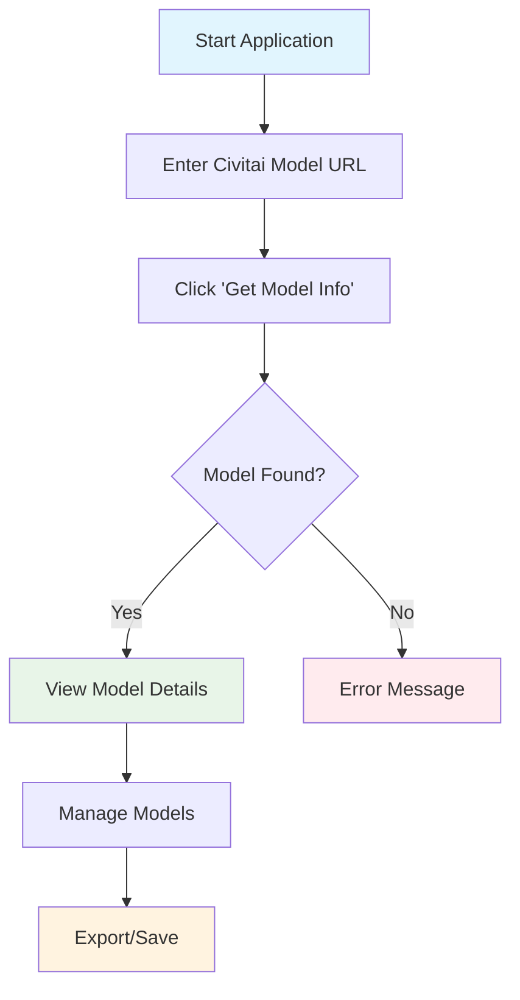
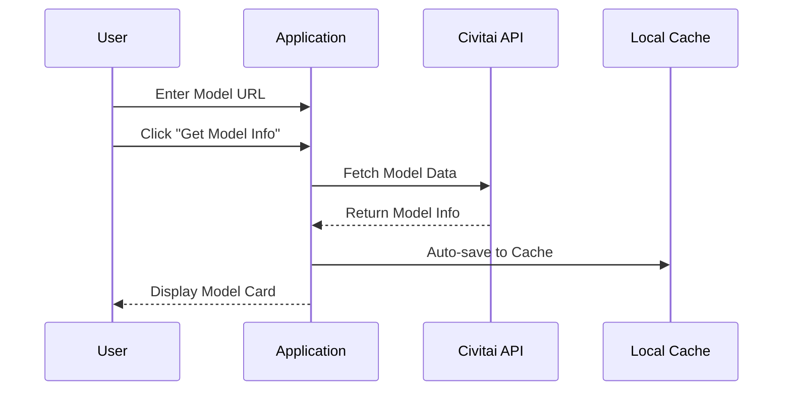
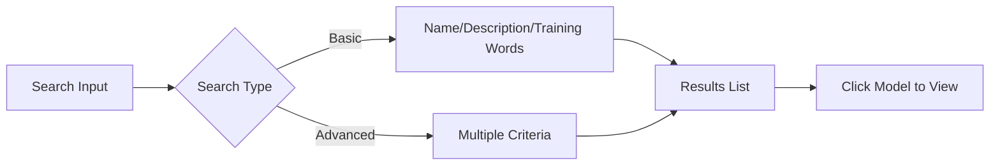
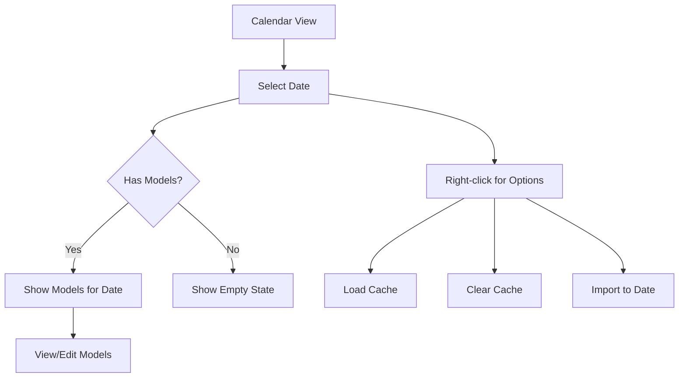
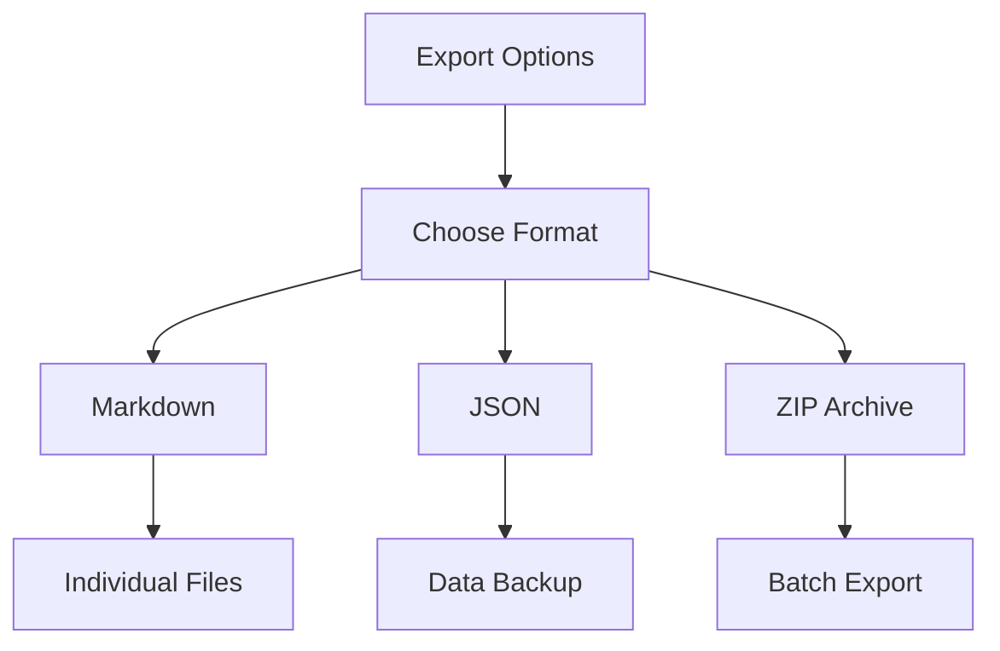

# How to Use - LoRA Model Info Downloader

*A comprehensive guide to using the LoRA Model Information Downloader*

## 🚀 Quick Start

### Web Version
1. Open your browser and navigate to the application URL
2. The interface will load with the main input area at the top

### Desktop Version  
1. Download and run the desktop application
2. The native window will open with the same interface

## 📋 Basic Workflow

## 🔧 Core Features

### 1. Model Information Retrieval

**Steps:**
1. Copy a Civitai model URL (e.g., `https://civitai.com/models/1843641/example-model`)
2. Paste it into the input field
3. Click **"Get Model Info"** button
4. Wait for the data to load

**What you'll get:**
- Model name and creator
- Multiple versions (if available)
- Training words
- Sample images with metadata
- Download links

### 2. Search Functionality

**Basic Search:**
- Enter keywords in the search box
- Search across model names, descriptions, training words
- Results update as you type (after 2 characters)

**Advanced Search:**
- Click "Advanced Search" to expand options
- Filter by creator username
- Search specific training words
- Filter by tags

**Search Shortcuts:**
- Click on popular tags for quick filtering
- Use preset filters (Recently Added, Most Images, etc.)

### 3. Calendar View

**Accessing Calendar:**
1. Click **"📅 Show Calendar"** button
2. Navigate between months using arrow buttons
3. Days with saved models appear highlighted

**Using Calendar:**
- **Click any date** to view models saved on that day
- **Right-click dates** for context menu options:
  - Load day cache
  - Clear day cache  
  - Import JSON to specific date
- **Hover over dates** to see model previews

### 4. Cache Management

**Auto-saving:**
- Models are automatically saved when added
- Daily records track when models were saved

**Manual Cache Operations:**
1. **Save to Cache**: Manually save current models
2. **Load from Cache**: Restore previously saved models  
3. **Clear Cache**: Remove all cached data
4. **Export Cache**: Save cache as JSON file
5. **Import Cache**: Load models from JSON file

**Quick Export:**
- Click "Quick Export" for immediate JSON download
- Use "Advanced Export" for more options

### 5. Export Features

**Available Formats:**
- **Markdown**: Individual model documentation
- **JSON**: Data backup and sharing
- **ZIP**: Batch export of multiple models

**Export Options:**
1. **Current Models**: Export currently displayed models
2. **All Cache**: Export complete cached database
3. **Daily JSON**: Export models grouped by save date
4. **Daily Markdown**: Export daily summaries in Markdown

## 🎯 Advanced Usage

### Managing Multiple Models
1. Add models one by one using URLs
2. Use search to filter large collections
3. Remove unwanted models using the ✕ button
4. Export collections for backup

### Date-based Organization
1. Use calendar to review historical saves
2. Import models to specific dates for organization
3. Clear old records to manage storage

### Data Migration
1. Export from one device as JSON
2. Import on another device to sync data
3. Use ZIP exports for sharing collections

## 🔍 Troubleshooting

### Common Issues

**Model not loading:**
- Check if the URL is from Civitai
- Ensure stable internet connection
- Try copying the URL again

**Search not working:**
- Ensure you have cached models to search
- Try different keywords
- Use advanced search for better filtering

**Cache issues:**
- Check browser storage permissions
- Clear browser data if corrupted
- Re-import from JSON backup

### Performance Tips
- Regularly export important collections
- Clear old cache data periodically  
- Use search instead of scrolling through large lists
- Close unused calendar/grid views

## 🎨 Customization

### Language Settings
- Click the 🌐 button in top-right corner
- Toggle between Chinese (中) and English (EN)

### Theme
- Application automatically detects system theme
- Supports light and dark modes

### Interface
- Resize window for desktop version
- Use browser zoom for web version
- Responsive design adapts to screen size

## 💡 Tips & Best Practices

1. **Regular Backups**: Export your collection regularly as JSON
2. **Organized Saving**: Use calendar feature to track when you discover models
3. **Efficient Search**: Use training words and tags for better search results
4. **Clean Management**: Remove duplicate or unwanted models regularly
5. **Cross-device Sync**: Use JSON export/import to sync between devices

## 🆘 Support

If you encounter issues:
1. Check the browser console for error messages
2. Try refreshing the application
3. Clear cache and restart if needed
4. Ensure you're using a supported browser (Chrome, Firefox, Safari, Edge)

---

*Last updated: January 2025*
