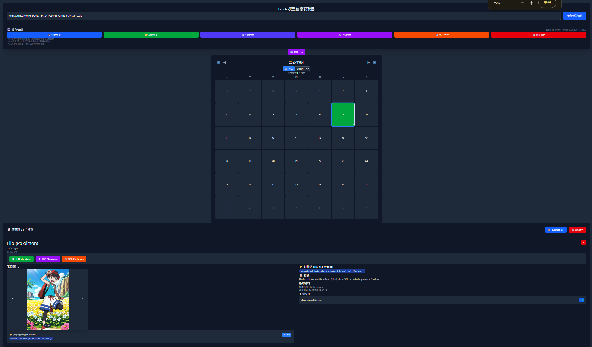
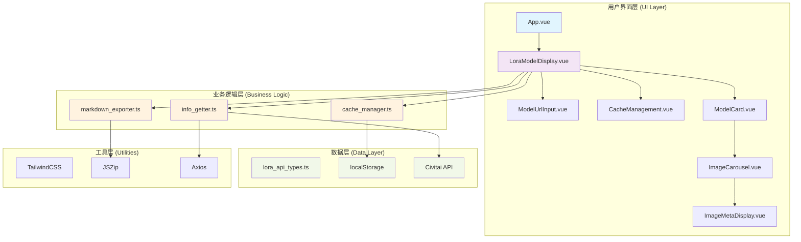
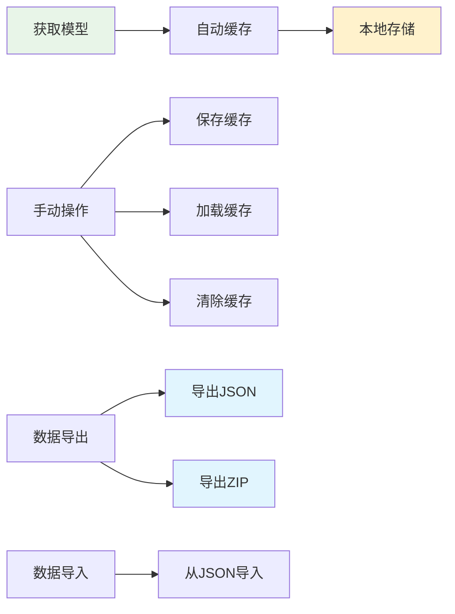

# LoRA 模型信息下载器

[English Version](./README_EN.md) | 中文版本

一个基于 Vue 3 + TypeScript + Tauri 的 LoRA 模型信息获取和管理工具，支持从 Civitai 获取模型详情、缓存管理、批量导出等功能。提供 Web 版本和桌面应用两种使用方式。



## ✨ 主要功能

- 🔍 **模型信息获取**: 通过 Civitai URL 获取 LoRA 模型详细信息
- 🌐 **多语言支持**: 支持中文/英文界面切换
- 🖼️ **图片轮播**: 展示模型示例图片，支持查看图片元数据
- 🏷️ **训练词显示**: 显示模型训练词和图片相关的提示词
- ⚙️ **参数展示**: 显示图片的采样器参数（步数、CFG、种子等）
- 🔎 **智能搜索**: 支持模糊搜索模型名称、描述、训练词和Prompt内容
- 💾 **缓存管理**: 本地存储缓存，支持自动保存和手动管理
- 📤 **数据导出**: 支持导出为 Markdown 和 JSON 格式
- 📥 **数据导入**: 支持从 JSON 文件导入模型数据
- 🌓 **深色模式**: 支持浅色/深色主题切换
- 📅 **日历视图**: GitHub 风格的日历展示模型记录历史
- 🖥️ **桌面应用**: 基于 Tauri 的原生桌面应用体验

## 🏗️ 项目架构



## 🛠️ 技术栈

| 技术 | 用途 | 版本 |
|------|------|------|
| Vue 3 | 前端框架 | ^3.5.18 |
| TypeScript | 类型安全 | ~5.8.0 |
| Tauri | 桌面应用框架 | ^2.7.0 |
| Rust | 后端运行时 | 1.77.2+ |
| Vite | 构建工具 | ^7.0.6 |
| TailwindCSS | 样式框架 | ^4.1.11 |
| Axios | HTTP 客户端 | ^1.11.0 |
| JSZip | ZIP 文件处理 | ^3.10.1 |

## 📁 项目结构

```text
src/
├── components/
│   ├── App.vue                    # 主应用组件
│   ├── LoraModelDisplay.vue       # 模型展示主组件
│   ├── ModelUrlInput.vue          # URL 输入组件
│   ├── ModelCard.vue              # 模型卡片组件
│   ├── ImageCarousel.vue          # 图片轮播组件
│   ├── ImageMetaDisplay.vue       # 图片元数据显示组件
│   ├── CacheManagement.vue        # 缓存管理组件
│   ├── Calendar.vue               # 日历组件
│   ├── CalendarDay.vue            # 日历日期组件
│   ├── CalendarTooltip.vue        # 日历提示框组件
│   ├── CalendarContextMenu.vue    # 日历右键菜单组件
│   ├── ExportPanel.vue            # 导出面板组件
│   ├── info_getter.ts             # API 数据获取
│   ├── cache_manager.ts           # 缓存管理逻辑
│   ├── markdown_exporter.ts       # Markdown 导出功能
│   ├── export_manager.ts          # 高级导出管理
│   ├── calendar_types.ts          # 日历类型定义
│   ├── calendar_utils.ts          # 日历工具函数
│   └── lora_api_types.ts          # TypeScript 类型定义
├── assets/                        # 静态资源
├── main.ts                        # 应用入口
└── style.css                      # 全局样式

src-tauri/
├── src/
│   ├── lib.rs                     # Tauri 库入口
│   └── main.rs                    # Tauri 主程序
├── icons/                         # 应用图标
├── Cargo.toml                     # Rust 依赖配置
├── tauri.conf.json               # Tauri 应用配置
└── build.rs                       # 构建脚本
```

## 🚀 快速开始

### 环境要求

#### 前端开发

- Node.js >= 20.19.0 或 >= 22.12.0
- npm 或 yarn

#### 桌面应用开发

- Rust >= 1.77.2
- Tauri CLI (`npm install -g @tauri-apps/cli` 或通过项目依赖)
- 平台特定依赖:
  - **Windows**: Microsoft Visual Studio C++ Build Tools
  - **macOS**: Xcode Command Line Tools
  - **Linux**: 参考 [Tauri 官方文档](https://tauri.app/zh-cn/v1/guides/getting-started/prerequisites)

### 安装依赖

```bash
npm install
```

### Web 开发模式

```bash
npm run dev
```

### 桌面应用开发模式

```bash
npm run tauri:dev
```

### 构建生产版本

#### Web 版本

```bash
npm run build
```

#### 桌面应用

```bash
npm run tauri:build
```

### 类型检查

```bash
npm run type-check
```

### Tauri 相关命令

```bash
# 初始化 Tauri (仅首次)
npx tauri init

# 开发模式启动
npx tauri dev

# 构建桌面应用
npx tauri build

# 生成应用图标 (需要准备 app-icon.png)
npx tauri icon

# 更新 Tauri 依赖
npx tauri upgrade
```

## � 部署与运行

### Web 版本部署

1. **开发环境**:
   ```bash
   npm run dev
   ```
   访问: `http://localhost:5174`

2. **生产构建**:
   ```bash
   npm run build
   npm run preview
   ```

3. **静态部署**: 构建后的 `dist` 目录可直接部署到任意静态托管服务

### 桌面应用

1. **开发调试**:
   ```bash
   npm run tauri:dev
   ```

2. **构建安装包**:
   ```bash
   npm run tauri:build
   ```
   
   构建产物位置:
   - **Windows**: `src-tauri/target/release/bundle/nsis/` (`.msi` 安装包)
   - **macOS**: `src-tauri/target/release/bundle/dmg/` (`.dmg` 磁盘映像)
   - **Linux**: `src-tauri/target/release/bundle/deb/` (`.deb` 包) 或 `appimage/` (`.AppImage`)

3. **应用特性**:
   - 🪟 原生窗口体验，支持最小化/最大化/关闭
   - 📐 可调整窗口大小，最小尺寸 800x600
   - 🎯 居中启动，默认大小 1200x800
   - 🛡️ 内置安全策略和权限管理
   - 💾 独立的应用数据存储目录

## �📖 使用说明

### 1. 获取模型信息

1. 在输入框中粘贴 Civitai 模型 URL
   - 示例: `https://civitai.com/models/1843641/acenix-katthe-mayictor-style`
2. 点击"获取模型信息"按钮
3. 系统会自动获取并显示模型详情

### 2. 查看模型详情

每个模型卡片包含以下信息：

- **基本信息**: 模型名称、作者、ID
- **训练词**: 模型的触发关键词
- **版本信息**: 不同版本的详细信息
- **示例图片**: 图片轮播和元数据
- **下载链接**: 模型文件下载地址

### 3. 图片功能

- **图片轮播**: 左右切换查看不同示例图片
- **元数据显示**: 每张图片显示：
  - 🏷️ 训练词 (Trigger Words)
  - ✅ 正面提示词 (Positive Prompt)
  - ❌ 负面提示词 (Negative Prompt)
  - ⚙️ 采样器参数 (Sampler Parameters)
- **一键复制**: 点击复制按钮快速复制相关内容

### 4. 智能搜索功能

#### 基础搜索
- 在搜索框中输入关键词进行模糊搜索
- 支持搜索：模型名称、描述、训练词、Prompt内容
- 实时搜索建议，提高搜索效率

#### 高级搜索
- 多条件组合搜索：模型名称、创建者、提示词等
- 支持训练词和标签的精确匹配
- 灵活的搜索条件组合

#### 快捷搜索
- 🏷️ 热门训练词和标签一键搜索
- ⚡ 快速过滤：最近添加、图片最多、训练词最多
- 📊 实时统计信息显示

#### 搜索管理
- 🗑️ 清空筛选：一键清除所有搜索条件
- 显示全部：回到完整模型列表
- 搜索结果统计

### 5. 缓存管理



#### 缓存功能说明

- **自动缓存**: 获取新模型时自动保存到本地
- **手动管理**:

  - 💾 保存缓存: 手动保存当前模型到本地
  - 📂 加载缓存: 从本地缓存恢复模型数据
  - 🗑️ 清除缓存: 删除本地存储的缓存数据

- **数据备份**:

  - 📤 导出JSON: 导出模型数据为JSON文件
  - 📥 导入JSON: 从JSON文件导入模型数据
  - 📦 批量导出ZIP: 导出所有模型的Markdown文件

### 5. 导出功能

#### Markdown 导出

- **单个模型**: 每个模型卡片都有独立的Markdown导出
- **批量导出**: 导出所有模型为ZIP文件，包含：
  - 每个模型的独立.md文件
  - 总览README.md文件，包含模型列表和跳转链接

#### JSON 导出

- 包含完整的模型数据结构
- 支持版本控制和数据校验
- 可用于跨设备同步和数据备份

## ⚙️ 配置说明

### Civitai API

项目使用 Civitai 公开 API 获取模型信息：

- API 端点: `https://civitai.com/api/v1/models/{modelId}`
- 无需 API Key（公开接口）
- 支持获取模型详情、版本信息、示例图片等

### 本地存储

- 使用 `localStorage` 存储缓存数据
- 缓存键: `lora_models_cache`
- 数据格式包含版本控制和元数据
- 自动数据校验和错误处理

## 🎨 界面特性

- **响应式设计**: 适配桌面端和移动端
- **深色模式**: 自动适应系统主题偏好
- **流畅动画**: 图片切换和界面交互动画
- **直观图标**: 使用 Emoji 图标提升用户体验
- **状态反馈**: 实时显示操作状态和结果

## 🔧 开发指南

### 添加新功能

1. 在 `lora_api_types.ts` 中定义新的类型
2. 在对应组件中实现功能逻辑
3. 更新相关的导出和缓存逻辑
4. 添加必要的错误处理

### 自定义样式

项目使用 TailwindCSS，可以：

- 修改 `tailwind.config.js` 自定义主题
- 在组件中使用 TailwindCSS 类名
- 在 `style.css` 中添加全局样式

### API 扩展

如需支持其他平台的模型：

1. 在 `info_getter.ts` 中添加新的API逻辑
2. 更新 `lora_api_types.ts` 的类型定义
3. 修改UI组件以支持新的数据结构

## 🤝 贡献指南

1. Fork 项目
2. 创建功能分支 (`git checkout -b feature/AmazingFeature`)
3. 提交更改 (`git commit -m 'Add some AmazingFeature'`)
4. 推送到分支 (`git push origin feature/AmazingFeature`)
5. 创建 Pull Request

## 📄 许可证

本项目采用 MIT 许可证 - 查看 [LICENSE](LICENSE) 文件了解详情。

## 🙏 致谢

- [Civitai](https://civitai.com/) - 提供模型数据API
- [Vue.js](https://vuejs.org/) - 优秀的前端框架
- [TailwindCSS](https://tailwindcss.com/) - 实用的CSS框架
- [Vite](https://vitejs.dev/) - 快速的构建工具

---

## 📝 更新日志

最后更新: 2025年8月8日
