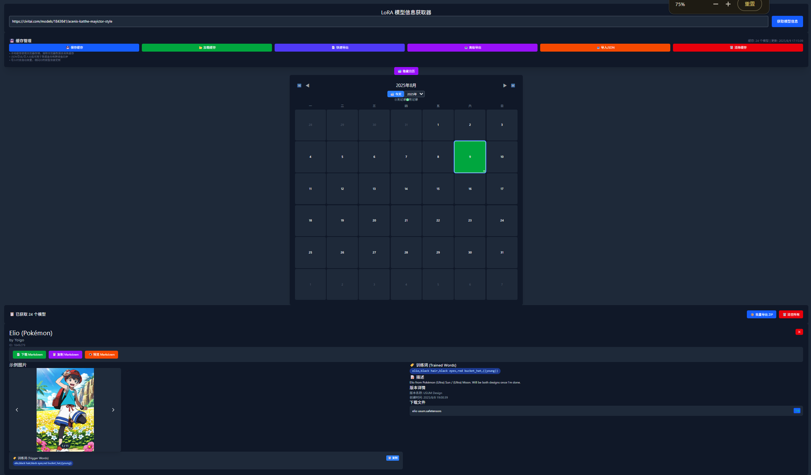

# LoRA Model Info Downloader

[中文版本](./README.md) | English Version

A LoRA model information retrieval and management tool based on Vue 3 + TypeScript + Tauri, supporting model detail fetching from Civitai, cache management, batch export, and more. Available in both web and desktop application versions.



## ✨ Key Features

- 🔍 **Model Information Retrieval**: Fetch detailed LoRA model information through Civitai URLs
- 🌐 **Multi-language Support**: Support for Chinese/English interface switching
- 🖼️ **Image Carousel**: Display model example images with metadata viewing support
- 🏷️ **Training Words Display**: Show model training words and image-related prompts
- ⚙️ **Parameter Display**: Show image sampler parameters (steps, CFG, seed, etc.)
- 🔎 **Smart Search**: Support fuzzy search for model names, descriptions, training words, and prompt content
- 💾 **Cache Management**: Local storage cache with auto-save and manual management
- 📤 **Data Export**: Support export to Markdown and JSON formats
- 📥 **Data Import**: Support importing model data from JSON files
- 🌓 **Dark Mode**: Support light/dark theme switching
- 📅 **Calendar View**: GitHub-style calendar for displaying model record history
- 🖥️ **Desktop Application**: Native desktop app experience based on Tauri

## 🏗️ Project Architecture


## 🛠️ Tech Stack

| Technology | Purpose | Version |
|------------|---------|---------|
| Vue 3 | Frontend Framework | ^3.5.18 |
| TypeScript | Type Safety | ~5.8.0 |
| Tauri | Desktop App Framework | ^2.7.0 |
| Rust | Backend Runtime | 1.77.2+ |
| Vite | Build Tool | ^7.0.6 |
| TailwindCSS | Styling Framework | ^4.1.11 |
| Axios | HTTP Client | ^1.11.0 |
| JSZip | ZIP File Processing | ^3.10.1 |

## 📁 Project Structure

```text
src/
├── components/
│   ├── App.vue                    # Main app component
│   ├── LoraModelDisplay.vue       # Model display main component
│   ├── ModelUrlInput.vue          # URL input component
│   ├── ModelCard.vue              # Model card component
│   ├── ImageCarousel.vue          # Image carousel component
│   ├── ImageMetaDisplay.vue       # Image metadata display component
│   ├── CacheManagement.vue        # Cache management component
│   ├── Calendar.vue               # Calendar component
│   ├── CalendarDay.vue            # Calendar day component
│   ├── CalendarTooltip.vue        # Calendar tooltip component
│   ├── CalendarContextMenu.vue    # Calendar context menu component
│   ├── ExportPanel.vue            # Export panel component
│   ├── LanguageSwitcher.vue       # Language switcher component
│   ├── info_getter.ts             # API data fetching
│   ├── cache_manager.ts           # Cache management logic
│   ├── markdown_exporter.ts       # Markdown export functionality
│   ├── lora_api_types.ts          # Type definitions
│   └── calendar_utils.ts          # Calendar utility functions
├── i18n/
│   └── index.ts                   # Internationalization support
├── main.ts                        # App entry point
└── style.css                      # Global styles
```

## 🚀 Getting Started

### Prerequisites

- Node.js (v20.19.0 or v22.12.0+)
- Rust (1.77.2+) - for desktop app
- Git

### Installation

1. **Clone the repository**

   ```bash
   git clone https://github.com/banned104/Civitai-LORA-Info.git
   cd Civitai-LORA-Info/LoraInfoDownloader
   ```

2. **Install dependencies**

   ```bash
   npm install
   ```

### Running the Application

#### Web Version

1. **Development mode**

   ```bash
   npm run dev
   ```

2. **Build for production**

   ```bash
   npm run build
   ```

#### Desktop Application

1. **Development mode**

   ```bash
   npm run tauri:dev
   ```

2. **Build desktop app**

   ```bash
   npm run tauri:build
   ```

## 📖 Usage Guide

### Basic Operations

1. **Add Models**
   - Enter a Civitai model URL in the input field
   - Click "Get Model Info" or press Enter
   - The model will be automatically added to your collection

2. **Language Switching**
   - Click the 🌐 language button in the top-right corner
   - Toggle between Chinese and English interfaces

3. **Search and Filter**
   - Use the search bar for quick filtering
   - Enable advanced search for multi-criteria filtering
   - Use search shortcuts for popular tags

### Cache Management

- 💾 **Save to Cache**: Store current models locally
- 📂 **Load from Cache**: Restore previously saved models
- 📄 **Quick Export**: Export models to JSON format
- 📤 **Advanced Export**: Choose export format and options
- 📥 **Import JSON**: Import model data from JSON files
- 🗑️ **Clear Cache**: Remove all cached data

### Calendar View

- 📅 View your model collection history in GitHub-style calendar
- Click on dates to view models saved on specific days
- Toggle between full calendar and data overview grid
- Import/export data for specific dates

### Search Features

#### Basic Search
- Enter keywords in the search bar for fuzzy searching
- Search across model names, descriptions, and training words

#### Advanced Search
- Multi-criteria combination search: model name, creator, prompts, etc.
- Filter by training words and tags
- Real-time search results

#### Quick Search
- 🏷️ One-click search for popular training words and tags
- Recent search history

#### Search Management
- 🗑️ Clear filters: One-click removal of all search criteria
- 📊 Show all: Return to full model list

## 🔧 Configuration

### Environment Setup

Create a `.env` file in the project root:

```env
# API Configuration
VITE_API_BASE_URL=https://civitai.com/api/v1
VITE_API_TIMEOUT=30000

# Cache Configuration
VITE_CACHE_EXPIRE_DAYS=30
VITE_MAX_CACHE_SIZE=100
```

### Tauri Configuration

Desktop app settings in `src-tauri/tauri.conf.json`:

```json
{
  "productName": "LoRA Info Downloader",
  "version": "1.0.0",
  "windows": [
    {
      "title": "LoRA Model Info Downloader",
      "width": 1200,
      "height": 800,
      "minWidth": 800,
      "minHeight": 600
    }
  ]
}
```

## 🤝 Contributing

We welcome contributions! Please follow these steps:

1. Fork the repository
2. Create a feature branch (`git checkout -b feature/AmazingFeature`)
3. Commit your changes (`git commit -m 'Add some AmazingFeature'`)
4. Push to the branch (`git push origin feature/AmazingFeature`)
5. Open a Pull Request

### Development Guidelines

- Follow TypeScript best practices
- Use Vue 3 Composition API
- Maintain consistent code formatting
- Add comments for complex logic
- Write tests for new features

## 📝 License

This project is licensed under the MIT License - see the [LICENSE](LICENSE) file for details.

## 🙏 Acknowledgments

- [Civitai](https://civitai.com/) for providing the model API
- [Vue.js](https://vuejs.org/) for the excellent frontend framework
- [Tauri](https://tauri.app/) for the desktop app framework
- [TailwindCSS](https://tailwindcss.com/) for the utility-first CSS framework

## 📞 Support

- 🐛 **Bug Reports**: [GitHub Issues](https://github.com/banned104/Civitai-LORA-Info/issues)
- 💡 **Feature Requests**: [GitHub Discussions](https://github.com/banned104/Civitai-LORA-Info/discussions)
- 📧 **Contact**: Create an issue for general inquiries

## 🔮 Roadmap

- [ ] Cloud sync support
- [ ] Plugin system for extensions
- [ ] Batch model processing
- [ ] Advanced filtering options
- [ ] Model comparison features
- [ ] Enhanced mobile support

---

⭐ If you find this project helpful, please consider giving it a star on GitHub!
