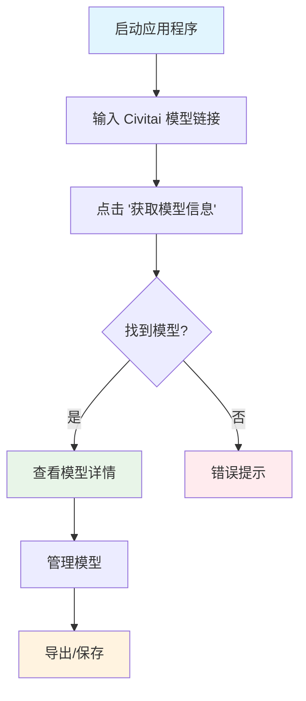
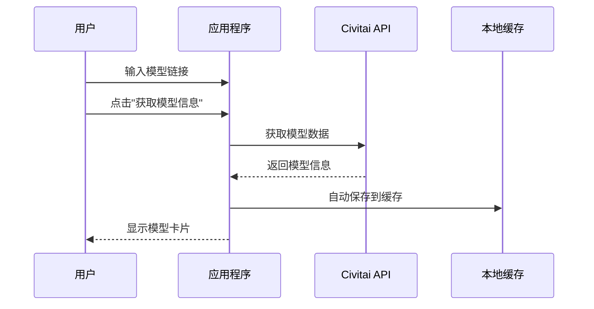
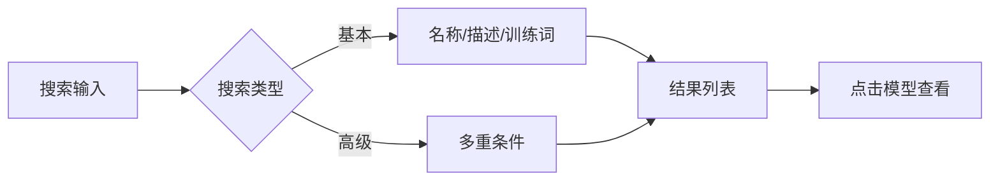
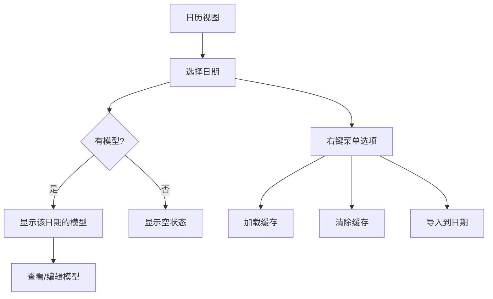
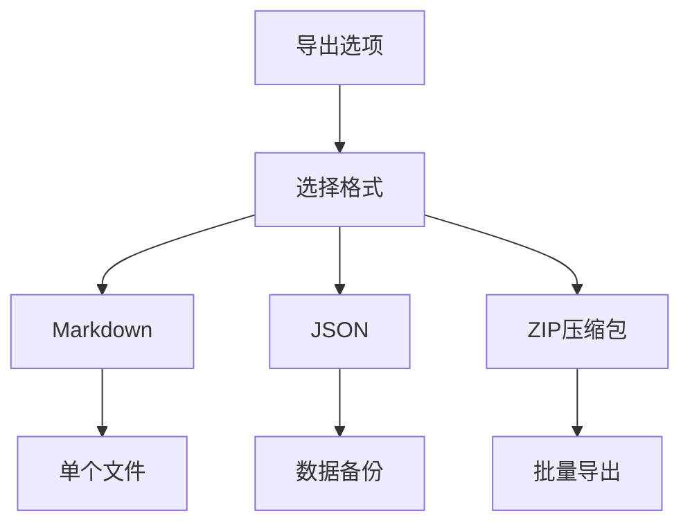
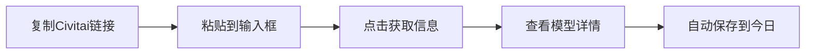
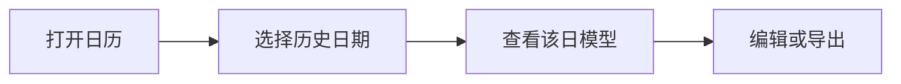
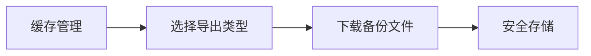

# 如何使用 - LoRA 模型信息下载器

LoRA 模型信息下载器的完整使用指南

## 🚀 快速开始

### 网页版本

1. 打开浏览器，访问应用程序网址
2. 界面加载后，顶部会显示主要的输入区域

### 桌面版本

1. 下载并运行桌面应用程序
2. 原生窗口会打开，显示相同的界面

## 📋 基本工作流程

## 🔧 核心功能

### 1. 获取模型信息

**操作步骤：**

1. 复制 Civitai 模型链接（例如：`https://civitai.com/models/1843641/example-model`）
2. 粘贴到输入框中
3. 点击 **"获取模型信息"** 按钮
4. 等待数据加载完成

**您将获得：**

- 模型名称和创建者信息
- 多个版本（如果有）
- 训练词
- 示例图片和元数据
- 下载链接

### 2. 搜索功能

**基本搜索：**

- 在搜索框中输入关键词
- 搜索模型名称、描述、训练词
- 输入2个字符后自动更新结果

**高级搜索：**

- 点击"高级搜索"展开选项
- 按创建者用户名筛选
- 搜索特定训练词
- 按标签筛选

**搜索快捷方式：**

- 点击热门标签进行快速筛选
- 使用预设筛选器（最近添加、图片最多等）

### 3. 日历视图

**访问日历：**

1. 点击 **"📅 显示保存历史日历"** 按钮
2. 使用箭头按钮在月份间导航
3. 保存了模型的日期会高亮显示

**使用日历：**

- **点击任意日期** 查看该日保存的模型
- **右键点击日期** 打开上下文菜单：
  - 加载日期缓存
  - 清除日期缓存
  - 导入JSON到指定日期
- **鼠标悬停** 查看模型预览

### 4. 缓存管理

**自动保存：**

- 添加模型时自动保存
- 每日记录跟踪模型保存时间

**手动缓存操作：**

1. **保存到缓存**：手动保存当前模型
2. **从缓存加载**：恢复之前保存的模型
3. **清除缓存**：删除所有缓存数据
4. **导出缓存**：将缓存保存为JSON文件
5. **导入缓存**：从JSON文件加载模型

**快速导出：**

- 点击"快速导出"立即下载JSON
- 使用"高级导出"获得更多选项

### 5. 导出功能

**可用格式：**

- **Markdown**：单个模型文档
- **JSON**：数据备份和分享
- **ZIP**：多个模型的批量导出

**导出选项：**

1. **当前模型**：导出当前显示的模型
2. **所有缓存**：导出完整的缓存数据库
3. **按日期JSON**：按保存日期分组导出模型
4. **按日期Markdown**：导出每日摘要的Markdown格式

## 🎯 高级用法

### 管理多个模型

1. 使用链接逐个添加模型
2. 使用搜索功能筛选大型集合
3. 使用 ✕ 按钮移除不需要的模型
4. 导出集合进行备份

### 基于日期的组织

1. 使用日历查看历史保存记录
2. 将模型导入到特定日期进行组织
3. 清除旧记录以管理存储空间

### 数据迁移

1. 从一个设备导出为JSON
2. 在另一个设备上导入以同步数据
3. 使用ZIP导出分享集合

## 🔍 故障排除

### 常见问题

**模型无法加载：**

- 检查链接是否来自Civitai
- 确保网络连接稳定
- 尝试重新复制链接

**搜索不工作：**

- 确保有缓存的模型可供搜索
- 尝试不同的关键词
- 使用高级搜索获得更好的筛选效果

**缓存问题：**

- 检查浏览器存储权限
- 如果数据损坏，清除浏览器数据
- 从JSON备份重新导入

### 性能提示

- 定期导出重要集合
- 定期清理旧的缓存数据
- 使用搜索而不是滚动浏览大型列表
- 关闭未使用的日历/网格视图

## 🎨 自定义设置

### 语言设置

- 点击右上角的 🌐 按钮
- 在中文（中）和英文（EN）之间切换

### 主题

- 应用程序自动检测系统主题
- 支持浅色和深色模式

### 界面

- 桌面版本可调整窗口大小
- 网页版本可使用浏览器缩放
- 响应式设计适应屏幕尺寸

## 💡 提示和最佳实践

1. **定期备份**：定期将您的集合导出为JSON
2. **有序保存**：使用日历功能跟踪发现模型的时间
3. **高效搜索**：使用训练词和标签获得更好的搜索结果
4. **清洁管理**：定期删除重复或不需要的模型
5. **跨设备同步**：使用JSON导出/导入在设备间同步

## 🔄 常用操作流程

### 添加新模型

### 查找历史模型

### 数据备份

## 🆘 获取支持

如果遇到问题：

1. 检查浏览器控制台的错误信息
2. 尝试刷新应用程序
3. 如需要，清除缓存并重启
4. 确保使用支持的浏览器（Chrome、Firefox、Safari、Edge）

## 🌟 特色功能详解

### 描述展开/折叠

- 长描述会自动折叠
- 点击 "More ⬇️" 按钮展开完整描述
- 点击 "Less ⬆️" 按钮折叠描述
- 虚化背景效果提供更好的视觉体验

### 智能搜索建议

- 基于历史数据提供搜索建议
- 自动补全常用训练词和标签
- 支持模糊匹配和精确搜索

### 数据日期网格

- 一目了然查看所有有数据的日期
- 网格布局显示，节省空间
- 点击任意日期快速跳转

---

*最后更新：2025年1月*
